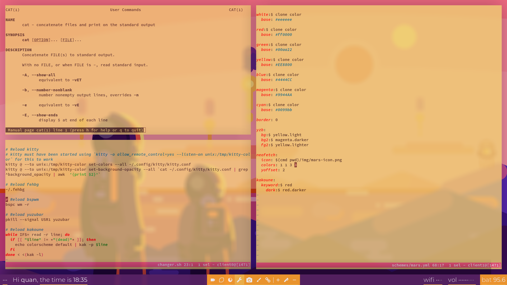
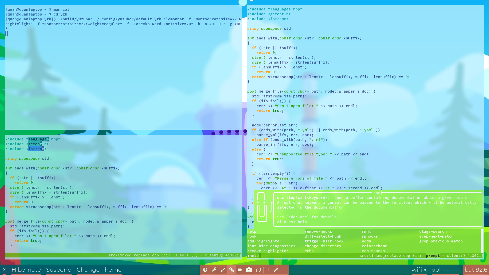

# theme-changer - Re-theme your desktop at a whim!
<p align="center">
  
  
</p>

Sure, your current Linux theme is great! But everything get old after a while, don't they?

Theme-changer will help you change the configuration of your WM, Compositor, Terminal, Text Editor, and more, within just one execution of a script.

## Dependencies
Theme-changer uses Linkt_replace to update the configuration files. You can get the tool by installing [Linkt](https://github.com/quandangv/linkt/)
```
git clone https://github.com/quandangv/linkt
cd linked_nodes
./build.sh -A
export LD_LIBRARY_DIR="$LD_LIBRARY_DIR:/usr/local/lib"
```

## Preparation
Theme-changer will configure some of the applications by default. These applications may not match the applications you use.

Go to `changer.sh`, there you will see blocks of code labeled with names of applications. You need to comment out the tools you don't use and uncomment the tools you do use. For example, you someone who use fehbg to set wallpaper and not nitrogen, would have this in their `changer.sh`:
```
# fehbg
config_cmd+="templates/fehbg ~/.fehbg "
reload_cmd+="~/.fehbg;"
                                                                                                       
# nitrogen
#config_cmd+="templates/nitrogen ~/.config/nitrogen/bg-saved.cfg "
#reload_cmd+="nitrogen --restore;"
```

## Change the theme!
In the `schemes` directory are the theme configurations, pass them to `changer.sh` to use that theme. For example: `./changer.sh schemes/mars.yml`
